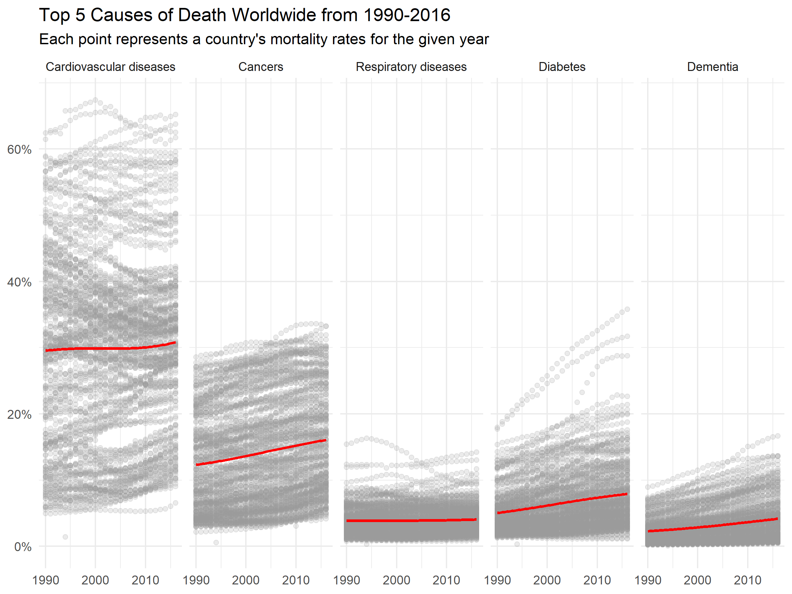
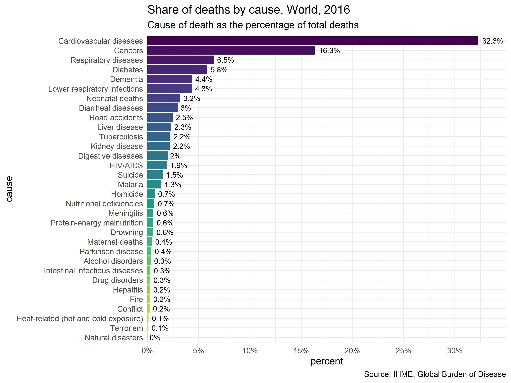
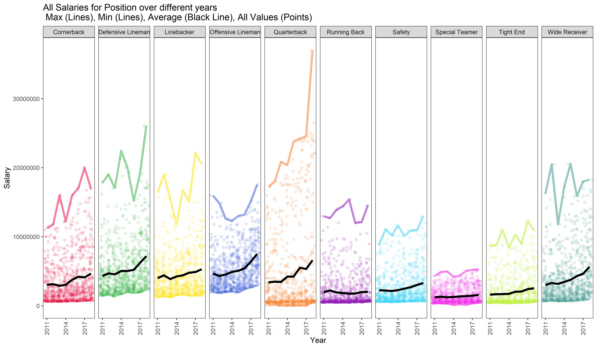
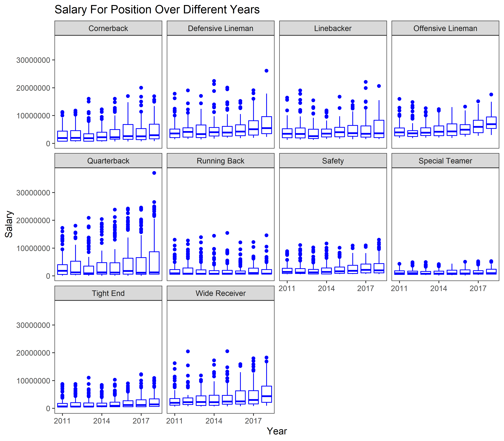
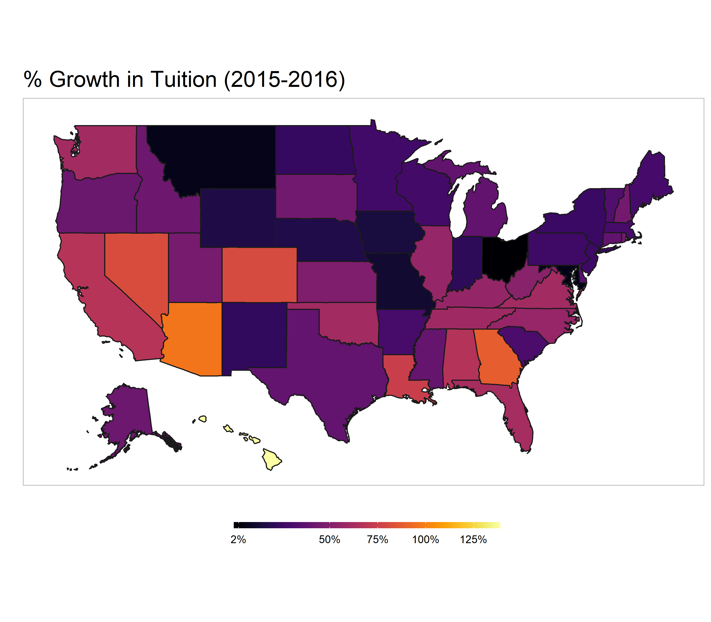

# tidytuesday
Figures and code from #tidytuesday

[Tidy Tuesday GitHub](https://github.com/rfordatascience/tidytuesday)

__Click on image to go to code__
## 2018
* __Wk 3: World Deaths__

  

    
     
  

* __Wk 2: NFL Player Salaries__

  

    
     
  

      
* __Wk 1: US Tuitions__

  

    
  

